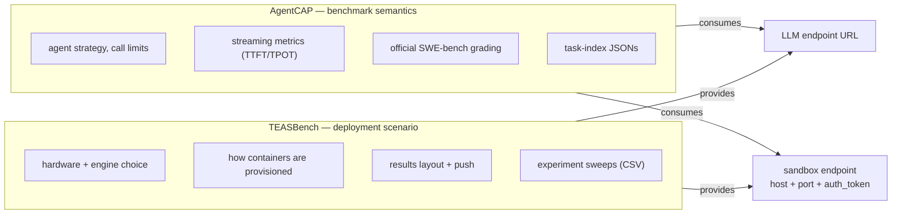
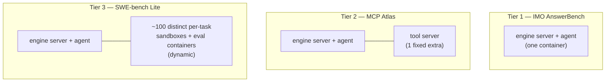
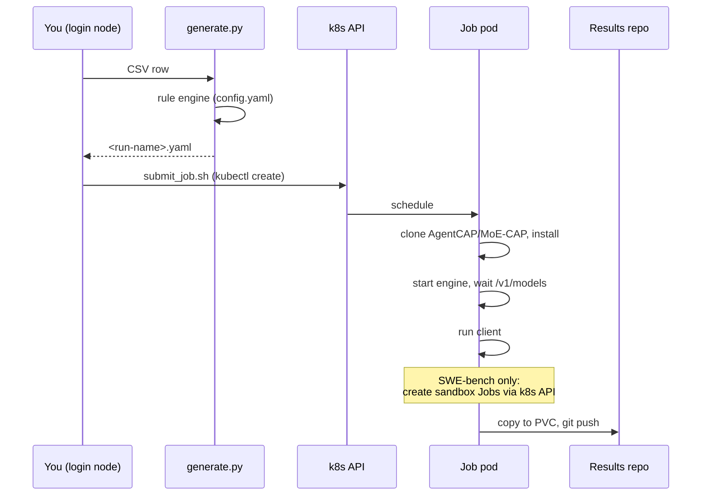
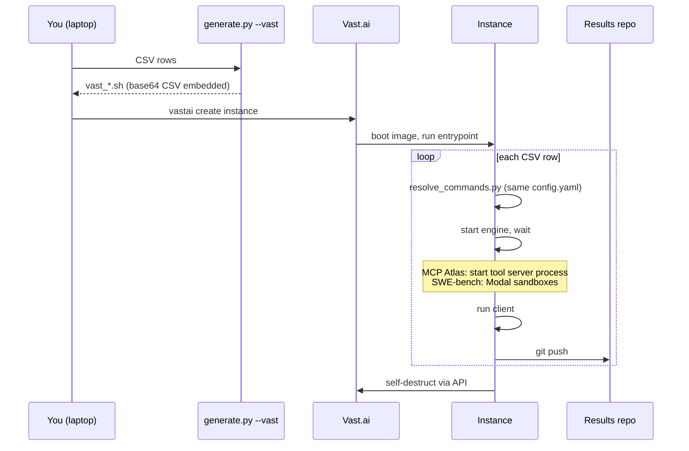
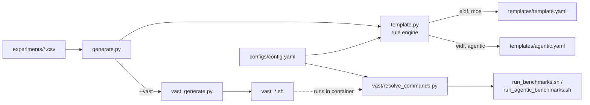
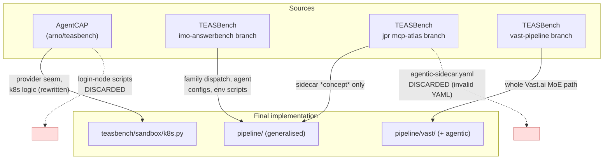

# TEASBench pipeline — developer guide

How the benchmark pipeline is built, why it is built that way, what was taken
from where, and what to be careful about.

For *how to run it*, see [USER_GUIDE.md](USER_GUIDE.md).
For the compact statement of the design rationale that code comments point at,
see [agentic-pipeline-design.md](agentic-pipeline-design.md); this document is
the long form and supersedes it where they overlap.

---

## 1. Scope and the problem being solved

TEASBench originally ran one kind of experiment: a **MoE** sweep — start an
inference server, run a client against it, record metrics. One self-contained
Kubernetes Job per CSV row on EIDF, later also one rented instance per group on
Vast.ai.

AgentCAP separately grew the ability to run **agentic** benchmarks — SWE-bench
Lite, MCP Atlas, IMO AnswerBench — including a working but bespoke Kubernetes
execution path for SWE-bench Lite on EIDF.

The goal of this work was to move the *operational execution* of agentic
benchmarks into TEASBench's existing pipeline, so that all four combinations of
{MoE, agentic} × {EIDF, Vast.ai} are steered the same way, from the same CSVs,
through the same rule engine — while leaving benchmark *semantics* in AgentCAP.

---

## 2. The central split



**AgentCAP's entire knowledge of its environment is two endpoints.** Everything
about *how* those endpoints come to exist is TEASBench's business.

The seam is provider resolution by dotted path:

```
--sandbox-provider teasbench.sandbox.k8s:InClusterK8sProvider
--exec-provider    teasbench.sandbox.k8s:InClusterK8sProvider
```

`agent_cap.agents.sandbox_providers.get_sandbox_provider()` resolves a name in
three ways, in order:

1. `http://` / `https://` prefix → `HttpSandboxProvider` (external broker)
2. contains `:` → dotted path `package.module:ClassName`, imported and instantiated
3. otherwise → built-in registry name (`k8s`, deprecated)

---

## 3. The four axes

Every experiment row is a point in a four-dimensional space. Understanding this
is most of understanding the codebase.

| Axis | Values | Selected by |
|---|---|---|
| **family** | `moe`, `agentic` | leading `family` CSV column |
| **benchmark** | gsm8k / arena-hard / longbench_v1 (MoE)<br/>imo-answerbench / mcp-atlas / swe-bench-lite (agentic) | `dataset` or `benchmark` column |
| **platform** | `eidf`, `vastai` | `platform` column (default `eidf`) / `--vast` |
| **engine** | `sglang`, `vllm` | `inference_engine` column |

`family` is **required and never inferred**. It selects the job template, the
image, the in-container runner and the results tree — too consequential to
leave implicit. `utils.benchmark_family()` raises on a missing or unrecognised
value, and cross-checks that `agentic` rows name a real agentic benchmark.

### Three benchmark tiers

The agentic benchmarks differ in exactly one respect that matters
operationally: **what extra containers they need.**



Tier 3 is the hard one: SWE-bench Lite uses one official Docker image *per
instance*, so a pre-warmed fixed pool cannot work. The provider interface must
be parameterised by image.

---

## 4. Capability, not mechanism

This is the design decision that makes one config serve two platforms. The
pipeline never says "pod sidecar"; it says "tool server endpoint", and each
platform implements it.

| Capability | EIDF | Vast.ai |
|---|---|---|
| LLM endpoint | in-pod `localhost:8000` | in-container `localhost:8000` |
| Tool server (MCP Atlas) | sidecar **container** in the pod | background **process** in the one container |
| SWE-bench sandboxes | k8s provider (TEASBench-owned) | **Modal** — native to swe-rex, no provider |
| SWE-bench grading | exec containers via the k8s provider | `SWEBENCH_HARNESS_MODAL=1` → harness `--modal true` |

Had "pod sidecar" been the modelled concept, Vast.ai would not have fitted at
all — it has no pods and no sidecars.

**Kubernetes is the only substrate that needs a sandbox provider.** `docker` and
`modal` are native swe-rex deployment types. This is why the provider seam is
small: it fills one specific hole rather than abstracting everything.

---

## 5. Execution model

### EIDF — one self-contained Job per row



Fire-and-forget: no login-node driver, no tunnels, no babysitting.

### Vast.ai — one rented instance per group



### The shared rule engine

Both platforms build their commands from the **same** `pipeline/configs/config.yaml`
through the **same** `template.py` rule engine. On EIDF `template.py` renders a
Job YAML; on Vast.ai `vast/resolve_commands.py` calls the same rule engine
inside the container and prints base64 command blocks. Nothing about a
benchmark is specified twice.



### Rule matching

`config.yaml` rules `match` on any experiment parameter; keys are ANDed, list
values ORed. Matching rules are applied in ascending specificity, so a general
rule sets a default and a more specific one overrides it. `platform` and
`benchmark` are ordinary match dimensions — which is what lets a single config
express "SWE-bench on EIDF uses the k8s provider; on Vast.ai it uses Modal".

---

## 6. What was integrated, and what was left out



### From AgentCAP

| Taken | How |
|---|---|
| `SandboxProvider` interface | Kept in AgentCAP; extended with dotted-path resolution |
| `_K8sSidecar` / `K8sSandboxProvider` logic | **Rewritten** into `teasbench/sandbox/k8s.py` as two providers |
| `K8sExecContainer` | Rewritten as `K8sExecHandle` behind a new `ExecProvider` seam |
| `patch_sweagent_streaming.py` | **Left in AgentCAP** — benchmark instrumentation, not deployment |
| Task-index JSONs (`benchmarks/*.json`) | **Left in AgentCAP** — benchmark definition |
| `HttpSandboxProvider` | Kept, unused — zero-cost escape hatch |

**Deliberately not ported:** `k8s/launch_llm_server.sh`, `k8s/port_forward_llm.sh`,
`k8s/run_one_experiment.sh`, `k8s/master_queue.sh`, `scripts/run_swebench_k8s_100.sh`,
`scripts/run_mcpatlas_k8s_60.sh`, `k8s/mcp-atlas-sidecar.yaml`.

These encode a **login-node driver model** — conda env on the head node,
`kubectl port-forward` tunnels, babysitter threads, a hand-written queue loop.
TEASBench's model is the opposite. Their *functions* map onto pipeline concepts
(`launch_llm_server.sh` → `@agentic_server_command@`; `master_queue.sh` → the
CSV + `generate.py` + `submit_job.sh` loop; `port_forward_llm.sh` → **nothing**,
it disappears when the driver runs in-cluster). Porting the scripts would have
grafted a second operational model onto a repo that deliberately has one.

`docs/REMOVING_K8S_FROM_AGENTCAP.md` in the AgentCAP repo is the plan for
deleting the now-duplicated k8s code there once TEASBench's providers are proven
on a real run.

### From the `imo-answerbench` branch — kept, and built on

Its shape was sound and became the backbone:

- family dispatch in `template.py` (`_moe()` / `_agentic()`)
- agent config YAMLs versioned in TEASBench (`pipeline/configs/agents/`)
- per-engine env-setup scripts inlined at generation time
  (`pipeline/scripts/setup_{sglang,vllm}_env.sh`)
- the agentic job template's overall shape

Changed: its `results_repo_dir()` emitted
`agentic/eidf/<engine>/<model>/<benchmark>_<N>tasks/<hw>x<n>`, which matches
neither the results repo nor `postprocessing/aggregate_results.py`'s 6-level
parser. Corrected to the real convention (§7).

### From the `jpr/pipeline-eidf-mcp-atlas` branch — concept kept, code discarded

The **idea** — run the MCP Atlas tool server as a sidecar in the same pod — is
right and was adopted. The **implementation** was not usable:

- `agentic-sidecar.yaml` was a ~300-line near-copy of `agentic-agents.yaml` and
  was **invalid YAML**: duplicate `containers:` key, `env:` misindented under
  `ports:`
- `template.py` resolved `sidecar_image` from the variable `agentsidecar_port`
- leftover `print("test")` / `print("test1")` debugging in the generator

More fundamentally, forking the whole job template per variant does not survive
a third variant. Replaced by **one** agentic template with composable blocks
that render empty when unused: `@sidecar_containers@`, `@sidecar_wait@`,
`@extra_setup@`, `@service_account@`, `@teas_env_exports@`, `@sandbox_provider@`.

### From the `u/welucas2/vast-pipeline` branch — taken wholesale

`pipeline/vast/` and `pipeline/vast_generate.py` were copied in as plain file
copies (not a git merge — that branch is based on an older `main`). Its central
good idea, `resolve_commands.py` reusing `template.py`'s rule engine rather than
duplicating logic, is what made extending it to the agentic family cheap.

The MoE Vast.ai path is otherwise untouched: generated launch scripts are
identical to that branch's output apart from the new `family` CSV column.

---

## 7. Results layout

Both families and both platforms write into the same 6-level convention, which
is the inverse of `results_repo_dir()` and what `aggregate_results.py` parses:

```
<family>/<platform>/<engine>/<model>/<dataset-or-benchmark>/<hw>x<n>/batch-size-<bs>/<timestamp>/
```

```
moe/eidf/sglang/gpt-oss-120b/gsm8k_256samples/a100x1/batch-size-default/…
agentic/vastai/sglang/gpt-oss-120b/swe-bench-lite/h200x1/batch-size-default/…
```

MoE encodes the sample count in the dataset level (`gsm8k_256samples`); agentic
does not (task counts are fixed per benchmark, and live in
`metrics.quality.total_examples`). `batch-size-default` is retained for agentic
purely so the level count stays 6 — agentic runs don't batch in the MoE sense.

---

## 8. Design decisions

Four decisions shaped everything. Three were put to the project owner because
they could not be resolved from the code.

### 8.1 Where does the SWE-bench driver run? → *implement both, default in-cluster*

SWE-bench Lite needs ~100 containers spawned mid-run, so the driver must reach
the Kubernetes API from wherever it runs.

- **In-cluster** (default): the Job pod creates sandbox Jobs via its
  ServiceAccount. Fire-and-forget, matches the MoE model, and pod IPs are
  directly routable — which deletes the port-forward machinery entirely.
- **Port-forward**: the ported AgentCAP approach, driven from a login node with
  your own kubectl credentials.

Both are implemented in `teasbench/sandbox/k8s.py`. The deciding fact — whether
EIDF grants pods RBAC for `jobs` and `pods` — could not be verified from a
laptop, so building both was the hedge. `eidf/rbac/teasbench-runner-rbac.yaml`
is the manifest to apply; if the project declines it, switch to
`PortForwardK8sProvider`.

The in-cluster provider is *smaller*, not merely relocated: ~80 lines of OS port
allocation, `start_new_session` detachment and a tunnel-babysitter thread exist
only because the original driver sat outside the cluster.

### 8.2 Remove k8s code from AgentCAP? → *keep as deprecated fallback, document removal*

Removing it immediately would break `--sweagent-deployment k8s` standalone before
the replacement had been proven on real hardware. The chosen path keeps it
working, adds the new seam alongside, and ships a written removal plan with
preconditions.

### 8.3 The HTTP sandbox broker → *defer, keep the seam broker-shaped*

The integration notes proposed AgentCAP calling a TEASBench-run HTTP broker.
Investigated against the future Vast.ai requirement and rejected for now:

- The archived Vast.ai SWE-bench runs used **Modal** for sandboxes, and swe-rex
  supports Modal natively — AgentCAP already has `--sweagent-deployment modal`
  with zero provisioning code. There is nothing for a broker to do.
- Every plausible rented-instance substrate (Modal, docker) is already native.
  Kubernetes is the one that isn't, which is exactly where the provider sits.
- The one case a broker uniquely enables — agent on Vast.ai, sandboxes on EIDF —
  is *actively bad for benchmarking*: agent↔sandbox RTT lands in per-task e2e
  latency, so a transcontinental hop would dominate the measured quantity.
- The secondary argument (keep substrate SDKs out of a brittle engine image)
  mostly evaporates: swe-rex and swebench must be installed there anyway, and
  the k8s provider shells out to the `kubectl` binary rather than importing a
  Python client.

`HttpSandboxProvider` is retained in AgentCAP so a broker remains a drop-in if a
genuine cross-substrate need appears.

### 8.4 Vast.ai agentic scope → *build it now*

Chosen over "design for it, build later". The consequence is that `platform`
became a first-class match dimension and capabilities are abstracted rather than
mechanisms (§4) — retrofitting that later would have been expensive.

### 8.5 Separate images per family (decided during implementation)

The agentic image adds SWE-agent, swebench, swe-rex, modal, uv and Node 20 on
top of an engine base image whose torch/transformers pins are notoriously
brittle — the EIDF agentic path needs a whole torch/torchvision repair script
for exactly this reason. Sharing one image would put that dependency risk on MoE
sweeps that need none of it. Two builds cost less than one broken MoE sweep.

---

## 9. Tradeoffs accepted

| Decision | Cost | Why accepted |
|---|---|---|
| Two k8s providers | ~80 extra lines, two paths to maintain | RBAC availability unverifiable in advance |
| Keep AgentCAP k8s code | Deployment knowledge in two places, will drift | Working path stays working until replacement is proven |
| Separate MoE/agentic images | Second build + registry push | Isolates brittle dependencies from working MoE sweeps |
| Two job templates (MoE + agentic) | ~70% structural overlap | Merging risks the production MoE path for no functional gain |
| `family` column required | Breaking CSV format change | Implicit family selection is too consequential to guess |
| Task counts not in results path | Can't distinguish 60- from 25-task runs by path | Matches existing repo convention and the aggregator's parser |

---

## 10. Software stack and environment dependencies

### Local (generation)

- Python 3 with `pandas`, `pyyaml` — in this project, `~/pyvenvs/teasbench/bin/python`
  (system `python3` lacks pandas)
- `git` (the generator embeds the TEASBench commit for provenance, so it must
  run inside the repo)
- `kubectl` configured for the namespace — EIDF only
- `vastai` CLI, authenticated — Vast.ai only

### EIDF cluster

- Kueue queue `<namespace>-user-queue`
- PVCs: `inputs-pvc`, `develop-pvc`, `eidf230shared`
- Secrets: results-repo token, plus per-benchmark judge/tool secrets
- **In-cluster SWE-bench only:** the RBAC in `eidf/rbac/teasbench-runner-rbac.yaml`
  (ServiceAccount + Role + RoleBinding for `batch/jobs`, `pods`, `pods/log`,
  `pods/exec`)

### Vast.ai

- Images pushed to a registry reachable by the instance
- Instance secrets (§ USER_GUIDE): `GIT_TOKEN`, `HF_TOKEN`, plus
  `OPENAI_API_KEY` (MoE) or `GEMINI_API_KEY` (+ `MODAL_TOKEN_*` for SWE-bench)
- `CONTAINER_ID` / `CONTAINER_API_KEY` are injected by Vast.ai and are how the
  instance destroys itself at the end — without them it would restart and rerun

### In-container (agentic)

AgentCAP, MoE-CAP, `swe-rex`, `swebench`, `modal`, SWE-agent (streaming-patched),
`uv`, Node 20 + npm (MCP Atlas), `jq`, `curl`.

---

## 11. Assumptions

These are load-bearing. If one is false, something breaks.

1. **Pod IPs are routable within the EIDF namespace.** The in-cluster provider
   talks to `http://<podIP>:9999` directly. Fails on a cluster with a restrictive
   NetworkPolicy.
2. **`kubectl` works in-cluster from the ServiceAccount token** with no kubeconfig.

> Assumptions 1 and 2 are the two that gate in-cluster SWE-bench, and both are
> checkable in about a minute with no GPU:
> `kubectl -n <ns> create -f eidf/preflight/teasbench-preflight.yaml`.
> The preflight replays `InClusterK8sProvider.acquire()` against a busybox
> target. See USER_GUIDE §4.6.
3. **Modal is reachable and authenticated** from a Vast.ai instance.
4. **Official SWE-bench instance images exist on Docker Hub** under the
   `docker.io/swebench/sweb.eval.x86_64.<iid>` naming with the `_1776_`
   substitution.
5. **The results repo is writable** by the token, and concurrent runs' pushes
   don't collide destructively (each run pulls before pushing).
6. **The MCP Atlas server set defines the benchmark** — enabling a different set
   makes numbers incomparable, hence the pinned list and parity test.
7. **`/dev/shm` is large enough** for checkouts and run dirs (EIDF mounts a
   16Gi in-memory emptyDir).

---

## 12. Potential issues to watch out for

**The `_swebench_image()` trap.** In `strategies_sweagent.py`, the function
branches on `deployment in ("modal", "k8s")` to pick `docker.io/swebench/...`
naming with a `_1776_` substitution. That is *registry* naming, not Kubernetes
semantics — which is why `modal` shares the branch. Removing `"k8s"` naively
produces unpullable image names for every EIDF run. See the removal doc.

**MCP Atlas credentials degrade silently.** Servers with blank API keys still
start and fail only at *tool-call* time, so a missing credential produces a lower
accuracy that reads as bad model behaviour. `write_mcp_env.sh` logs which keys
were supplied and which were empty (names only) — check that log before comparing
against reference numbers.

**Agent↔sandbox RTT is part of the measurement.** It lands in per-task e2e
latency (not TTFT/TPOT, which measure only the LLM stream). Where sandboxes are
placed is therefore part of the measured scenario and belongs in run metadata.
This is also why cross-continent sandbox brokering is a bad idea (§8.3).

**Streaming patch drift.** If SWE-agent is not streaming-patched, the run
completes but agentic metrics are empty. Both platforms assert the
`AGENTCAP_STREAMING_PATCH_APPLIED` marker; keep the Vast.ai image build and the
`extra_setup` verification in step.

**`GTFAEvaluatorAdapter` ignores its kwargs.** The MCP Atlas judge reads
`EVAL_LLM_MODEL` / `EVAL_LLM_BASE_URL` / `EVAL_LLM_API_KEY` from the environment
and discards constructor arguments, so the `judge:` block in the mcp-atlas agent
YAML is inert. Real wiring goes through env exports. This is an AgentCAP wart
worth fixing upstream.

**`served_model_name` vs litellm.** SWE-bench passes a litellm model string that
must match what the engine serves. Reused from the IMO config and not verified
against a live engine.

**CSV format is now breaking.** Any experiments CSV without a leading `family`
column fails with a clear error — including CSVs on other branches.

**Blackwell GPUs are unmapped.** `VAST_GPU_MAP` covers A100/H100/H200. The
archived reference agentic runs are on B200/B300. Take the exact Vast.ai
`gpu_name` strings from `vastai search offers` — a wrong one silently matches no
offers.

---

## 13. Tests and invariants

```bash
~/pyvenvs/teasbench/bin/python -m pytest tests/ -q
```

| File | Pins |
|---|---|
| `test_generate_pipeline.py` | MoE generation unchanged; agentic path conventions round-trip through the aggregator's parser |
| `test_vast_generate.py` | Family split, per-benchmark script naming, secret sets, image separation, `family` required |
| `test_sandbox_providers.py` | Both k8s providers, fully mocked — no cluster, no kubectl, no network |
| `test_mcp_env.py` | EIDF and Vast.ai enable the identical 22 MCP servers; `.env` generation, provenance without values, mode 600 |

**The load-bearing invariant is that MoE generation is byte-for-byte unchanged.**
Verify by reconstructing the pre-change generator from git and diffing its output:

```bash
mkdir -p .oldgen/configs .oldgen/templates
for f in generate.py template.py utils.py; do git show <ref>:pipeline/$f > .oldgen/$f; done
git show <ref>:pipeline/configs/config.yaml > .oldgen/configs/config.yaml
git show <ref>:pipeline/templates/template.yaml > .oldgen/templates/template.yaml
(cd .oldgen && python generate.py --csv_file=<csv> --target_dir=./out)
diff -r .oldgen/out <new-output-dir>
```

Two failures in `tests/test_agentic_compute_cost_cli.py` and
`tests/test_moe_compute_sparsity_cli.py` are **pre-existing** and unrelated
(both in `postprocessing/`, failing on a clean tree).

---

## 14. Known gaps

Nothing here has been executed on a cluster or a rented instance. Everything is
verified at the generation layer: correct manifests and scripts, valid syntax,
correct flags and paths.

| Gap | Impact |
|---|---|
| Agentic Docker images never built | Largest untested surface — uv, Node 20, npm preinstall, patched SWE-agent all added to a brittle base |
| EIDF RBAC not confirmed | In-cluster SWE-bench blocked until applied; fallback exists |
| Modal auth not exercised end to end | Vast.ai SWE-bench |
| `served_model_name` unverified | Possible SWE-bench 404s |
| B200/B300 unmapped | Cannot reproduce archived Vast.ai reference runs as-is |

Building one agentic image locally would retire most of the remaining risk in a
single step.
