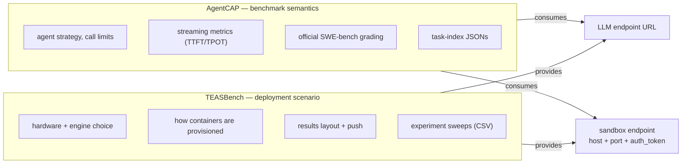
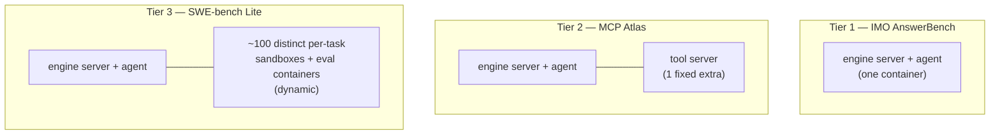
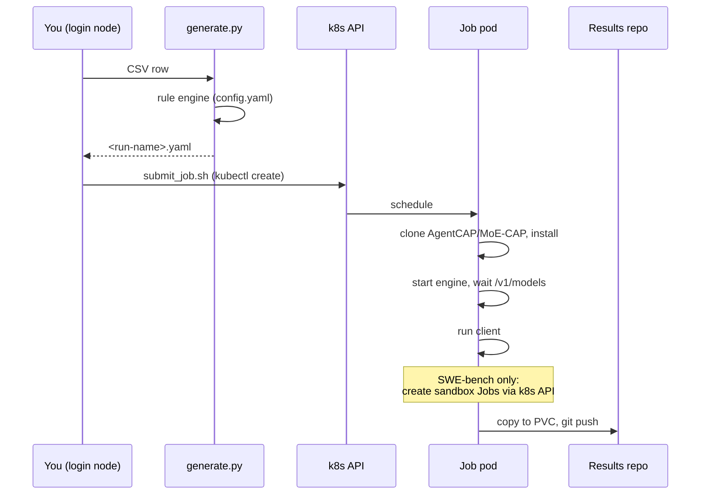
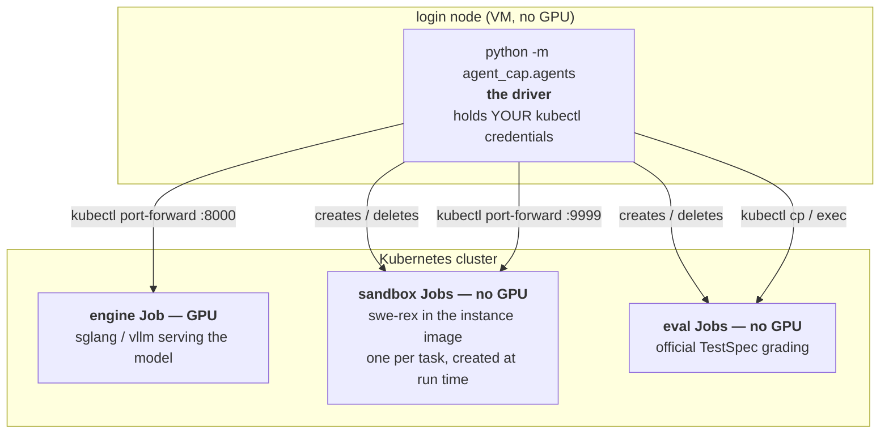
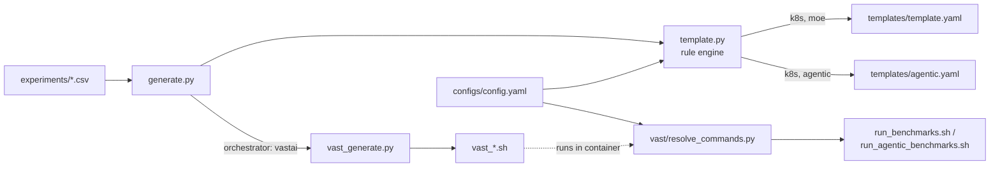
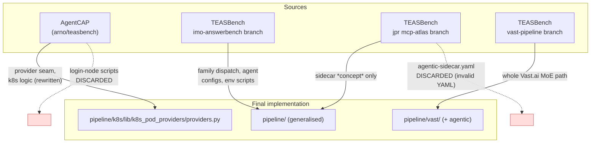

# TEASBench pipeline — developer guide

How the benchmark pipeline is built, why it is built that way, what was taken
from where, and what to be careful about.

For *how to run it*, see [USER_GUIDE.md](USER_GUIDE.md).
For the compact statement of the design rationale that code comments point at,
see [agentic-pipeline-design.md](agentic-pipeline-design.md); this document is
the long form and supersedes it where they overlap.

---

## 1. Scope and the problem being solved

TEASBench originally ran one kind of experiment: a **MoE** sweep — start an
inference server, run a client against it, record metrics. One self-contained
Kubernetes Job per CSV row on a K8s cluster, later also one rented instance per group on
Vast.ai.

AgentCAP separately grew the ability to run **agentic** benchmarks — SWE-bench
Lite, MCP Atlas, IMO AnswerBench — including a working but bespoke Kubernetes
execution path for SWE-bench Lite on Kubernetes.

The goal of this work was to move the *operational execution* of agentic
benchmarks into TEASBench's existing pipeline, so that all four combinations of
{MoE, agentic} × {K8s, Vast.ai} are steered the same way, from the same CSVs,
through the same rule engine — while leaving benchmark *semantics* in AgentCAP.

---

## 2. The central split



**AgentCAP's entire knowledge of its environment is two endpoints.** Everything
about *how* those endpoints come to exist is TEASBench's business.

The seam is provider resolution by dotted path:

```
--sandbox-provider k8s_pod_providers:InClusterK8sProvider
--exec-provider    k8s_pod_providers:InClusterK8sProvider
```

`agent_cap.agents.sandbox_providers.get_sandbox_provider()` resolves a name in
three ways, in order:

1. `http://` / `https://` prefix → `HttpSandboxProvider` (external broker)
2. contains `:` → dotted path `package.module:ClassName`, imported and instantiated
3. otherwise → built-in registry name (`k8s`, deprecated)

---

## 3. The four axes

Every experiment row is a point in a four-dimensional space. Understanding this
is most of understanding the codebase.

| Axis | Values | Selected by |
|---|---|---|
| **family** | `moe`, `agentic` | leading `family` CSV column |
| **benchmark** | gsm8k / arena-hard / longbench_v1 (MoE)<br/>imo-answerbench / mcp-atlas / swe-bench-lite (agentic) | `dataset` or `benchmark` column |
| **platform** (site) | `eidf`, `vastai` | `--site`, else the `platform` column, else `eidf` |
| **orchestrator** | `k8s`, `vastai` | derived — declared by the site profile |
| **engine** | `sglang`, `vllm` | `inference_engine` column |

**Site vs orchestrator.** `platform` names a *site* — one concrete place runs
happen — and is also the label results are published under
(`TEAS_Results_Private/{moe,agentic}/eidf/...`, alongside `amd`, `cerebras`,
`dgx-spark`, `tenstorrent`, `vastai`), which is why it stays `eidf` rather than
becoming `k8s`. Each site has a profile in `pipeline/configs/sites/<name>.yaml`
holding everything cluster-specific: namespace, Kueue queue, PVC names, GPU
node-label values, model staging root, and whether pods are granted RBAC. That
profile declares the *orchestrator* — how work is launched — and `config.yaml`
rules and `utils.py` predicates branch on that, never on the site. Adding a
second Kubernetes cluster is therefore a new profile and no code change.

`family` is **required and never inferred**. It selects the job template, the
image, the in-container runner and the results tree — too consequential to
leave implicit. `utils.benchmark_family()` raises on a missing or unrecognised
value, and cross-checks that `agentic` rows name a real agentic benchmark.

### Three benchmark tiers

The agentic benchmarks differ in exactly one respect that matters
operationally: **what extra containers they need.**



Tier 3 is the hard one: SWE-bench Lite uses one official Docker image *per
instance*, so a pre-warmed fixed pool cannot work. The provider interface must
be parameterised by image.

---

## 4. Capability, not mechanism

This is the design decision that makes one config serve two platforms. The
pipeline never says "pod sidecar"; it says "tool server endpoint", and each
platform implements it.

| Capability | K8s cluster | Vast.ai |
|---|---|---|
| LLM endpoint | in-pod `localhost:8000` | in-container `localhost:8000` |
| Tool server (MCP Atlas) | sidecar **container** in the pod | background **process** in the one container |
| SWE-bench sandboxes | k8s provider (TEASBench-owned) | **Modal** — native to swe-rex, no provider |
| SWE-bench grading | exec containers via the k8s provider | `SWEBENCH_HARNESS_MODAL=1` → harness `--modal true` |

Had "pod sidecar" been the modelled concept, Vast.ai would not have fitted at
all — it has no pods and no sidecars.

**Kubernetes is the only substrate that needs a sandbox provider.** `docker` and
`modal` are native swe-rex deployment types. This is why the provider seam is
small: it fills one specific hole rather than abstracting everything.

---

## 5. Execution model

### K8s cluster — one self-contained Job per row



Fire-and-forget: no login-node driver, no tunnels, no babysitting.

### Vast.ai — one rented instance per group


### K8s without pod RBAC + SWE-bench Lite — the exception to the Job model

**Some clusters do not grant pods RBAC** -- EIDF among them, and it is the cluster
this path was validated on. A pod cannot create Jobs or read pods via its
ServiceAccount, so `InClusterK8sProvider` is unusable there and SWE-bench Lite
uses `PortForwardK8sProvider`, driven from a **login node**.

This is the one place TEASBench's fire-and-forget model does not hold — but it is
narrower than "no Kubernetes". **The GPUs are still used exactly as always: via
Jobs.** What moves off the cluster is only the *driver process*.



**Why this works without RBAC.** Submitting a Job is something *you* are allowed
to do — the port-forward preflight confirms `create jobs` and
`create pods/portforward` are granted to your account. What is refused is
granting those rights to a *pod's ServiceAccount*. Moving the driver to the login
node swaps the pod's identity for yours, and the whole thing becomes permissible.

**Three kinds of Job are still created**, all with your credentials: one
long-lived engine Job on GPUs, and per task a short-lived sandbox Job and eval
Job on CPU only. The driver reaches all of them through `kubectl port-forward`,
which is why that provider carries a tunnel-babysitter thread.

**Only SWE-bench is affected.** IMO AnswerBench and MCP Atlas never touch the
Kubernetes API — MCP Atlas talks to a pod sidecar over `localhost` — so both
still run as ordinary generated Jobs, unattended, exactly like MoE.

**A consequence for §6's provenance table.** I argued that AgentCAP's
`k8s/launch_llm_server.sh` and `k8s/port_forward_llm.sh` should not be ported
because the in-cluster driver made them unnecessary. Under the confirmed
no-RBAC reality that is only true for IMO AnswerBench and MCP Atlas. For
SWE-bench on such a cluster their *function* — a server-only Job plus a tunnel to it — is
required. That function now lives in the pipeline: a row needing a login-node
driver (`utils.needs_login_node_driver`) renders **two** artifacts instead of
one, via `Template.get_artifacts()`:

| Artifact | Template | Role |
|---|---|---|
| `<run>.engine.yaml` | `templates/agentic-engine.yaml` | engine-only Job, GPUs, no client |
| `<run>.sh` | `templates/agentic-driver.sh` | submits it, tunnels, runs, tears down |

So the *shape* of AgentCAP's two scripts returns, but generated from the same
CSV row and the same `config.yaml` rules as everything else, rather than
hand-maintained. The engine Job is never submitted by hand, and the driver
deletes it on every exit path — an aborted run cannot strand GPUs.

### Tunnel robustness: drop journal, retry classification, and the completeness gate

The babysitter thread in `_PortForwardSandbox` (`pipeline/k8s/lib/k8s_pod_providers/providers.py`)
— and the engine-tunnel babysitter in `agentic-driver.sh` — used to only check
that the local `kubectl port-forward` process hadn't exited. That misses the
failure that actually killed tasks in production: the tunnel's stream breaks
(e.g. an apiserver-side reset) while the local process keeps running, so the
old check reported perpetual health while every request through the tunnel
failed. Both babysitters now HTTP-probe the thing they're actually meant to
keep working — `/is_alive` for a sandbox, `/v1/models` for the engine —
require a few consecutive failures before acting (so one slow response under
load doesn't trigger a needless restart), and restart onto the **same** local
port, because SWE-agent and the client are handed that port once at launch and
have no way to learn a new one.

**A trap worth knowing about.** `engine-portforward.log` is a misleading place
to debug a dropped *sandbox* tunnel. In the evidence run that motivated this
work, all 21 `error: lost connection to pod` lines in that file were benign
warm-up churn while vLLM was still loading, and the 7 mid-run
`error copying from local connection to remote stream` lines each landed
2–19s *after* a task had already been SIGKILLed by its outer `timeout` — an
effect of the kill, not a cause of it. The actual sandbox-tunnel failures
(`aiohttp ServerDisconnectedError` out of `swerex/runtime/remote.py`) never
touch that file at all; they show up in `portforward-events.jsonl` and in
`task_<id>/sweagent_std{out,err}.log`.

#### The drop journal — `$TEASBENCH_PF_EVENTS`

One JSON object per line, appended under a module-level lock, written by both
`providers.py`'s `_journal()` (sandbox tunnels) and the driver's
`_journal_engine()` (the engine tunnel). A journalling failure (e.g. a full
disk) is swallowed, never raised — the journal exists to make failures *more*
visible, not to introduce a new one.

```json
{"ts": 1770000000.12, "label": "django__django-14787", "event": "pf_drop",
 "phase": "running", "reason": "probe_failed", "job": "swe-rex-abc12",
 "pod": "swe-rex-abc12-x9k", "local_port": 41235, "pid": 12345,
 "detail": "optional free text"}
```

| Field | Meaning |
|---|---|
| `label` | the value passed to `acquire(image, label)` — for a sandbox this is the SWE-bench `instance_id` (`agent_cap/agents/strategies_sweagent.py:127-128`), so it keys straight to `task_id`. The engine tunnel writes the reserved label `"__engine__"`, which never collides with a real task id; the retry classifier only ever looks up labels matching a `task_id`, so `"__engine__"` rows are invisible to it and only show up in the report's journal tally. |
| `event` | one of `acquire`, `pf_start`, `pf_drop`, `pf_restart`, `pf_unrecoverable`, `release` |
| `phase` | `"startup"` or `"running"` — see below, this is load-bearing |
| `reason` | `probe_failed`, `process_exited`, `pod_gone`, `restart_exhausted` (on `pf_drop` / `pf_unrecoverable`); omitted elsewhere |
| `job`, `pod`, `local_port`, `pid`, `detail` | optional, best-effort context |

**Why `phase` is load-bearing.** `_PortForwardSandbox.start()` already
restarts the tunnel while the sandbox pod is still `pip install`-ing swe-rex —
that's ordinary, expected startup churn, and every sandbox does it at least
once. Those restarts are tagged `phase: "startup"`. Only a drop the babysitter
itself observes — i.e. *after* `/is_alive` first succeeded — is tagged
`phase: "running"`, and the retry classifier below only ever acts on
`"running"` drops. Without that distinction, ordinary startup churn on every
task would look identical to a real infrastructure failure, and the
classifier's whole purpose — telling "genuinely failed" from "infra hiccup" —
would collapse.

#### Retry classification — `swebench_run_audit`

New module, `pipeline/k8s/lib/swebench_run_audit.py`, stdlib-only, driven as
`python -m swebench_run_audit <retry-list|prune|report>`. A task is only
classified at all if it's *incomplete* —
`not (row["output_text"] or "").strip()`, exactly the condition under which
AgentCAP's own evaluator refuses to buffer it for grading in the first place.
Complete tasks are never touched.

| Evidence (first match wins) | Retry? | Reason tag |
|---|---|---|
| journal has a `pf_drop` row for this task with `phase: "running"` | **yes** | `pf_drop_running` |
| `row["errors"][0]` starts with `"k8s sidecar failed:"` — `provider.acquire()` itself raised (sandbox job create failed, pod not Running, swerex not alive) | **yes** | `sidecar_error` |
| `sweagent_stdout.log` / `sweagent_stderr.log` contains `ServerDisconnectedError`, `Server disconnected`, `Cannot connect to host 127.0.0.1:`, or `SessionExistsError` | **yes** | `log_signature` |
| `sweagent_rc == 124` (outer `timeout` SIGKILL), `--retry-timeouts 1`, no prior timeout retry for this task | **yes**, once only | `timeout_first_retry` |
| `sweagent_rc == 124`, `--retry-timeouts 0` | no | `timeout_not_retried` |
| `sweagent_rc == 124`, already retried once (an earlier `results.attempt-*.jsonl` already shows `sweagent_rc == 124` for this task) | no | `timeout_retry_exhausted` |
| none of the above — SWE-agent's own `exit_cost` / `exit_format` / `exit_context`, or `sweagent_rc == 0` with an empty patch (agent finished, submitted nothing) | no | `no_evidence` |

The last row is the one to hold the line on: retrying a task the agent itself
gave up on hands it a second sample it didn't earn, while every task that only
got one shot keeps a single sample — that biases accuracy upward for exactly
the tasks that were hardest, the opposite of what a retry mechanism aimed at
infrastructure noise should do. Same reasoning for `timeout_retry_exhausted`:
under a fixed per-instance call/step budget a task that timed out once will
time out again deterministically, so a second retry burns cluster time for a
result rule 4 already predicts.

`prune RUN_DIR --tasks-file FILE --attempt N` prepares a resume pass for the
tasks `retry-list` selected:

- archives `results.jsonl` to `results.attempt-N.jsonl` and rewrites
  `results.jsonl` with exactly one row per `task_id` (last occurrence wins),
  **with the retried tasks removed entirely**. AgentCAP's `--resume` skips any
  `task_id` already present in `results.jsonl`, errors or not
  (`agent_cap/agents/cli.py:503-506`, `_load_resume` at `:735-749`); leaving a
  retried task's row in place would mean it never actually re-runs. Duplicate
  rows are collapsed here too, because `cli.py:636-661` patches only the
  *last* occurrence of a `task_id` on write-back — a stray duplicate silently
  makes the run's own denominator 101-for-100 and skews `metrics.json`.
- deletes `task_<id>/stream_stats.jsonl` for each retried task. It's opened in
  **append** mode (`agent_cap/sweagent_streaming/__init__.py:320`) and summed
  whole-file (`strategies_sweagent.py:234-252`); left in place, a retried task
  would report attempt-1 + attempt-2 tokens as one number.
- deletes `task_<id>/sweagent_traj/` for each retried task.
  `strategies_sweagent.py:216-226` globs `*.traj` by mtime and takes the first
  with a non-empty `info.submission`; left in place, a retry that itself fails
  to produce a patch can silently inherit the *earlier* attempt's patch
  instead of correctly reporting empty.

`report RUN_DIR --attempts N [--out completeness.json]` is the publish gate.
It re-classifies every task (always with `retry_timeouts=True` — `report` has
no `--retry-timeouts` flag of its own, since that's a driver-loop policy
knob, not a property of the run itself, so it treats an unexhausted timeout as
still-fixable and only an exhausted one as genuinely failed), flags any task
that regressed `resolved: true -> false` across successive
`results.attempt-*.jsonl` snapshots (possible because `finalize()` re-grades
every buffered instance from scratch each attempt and writes wholesale, no
merge — `evaluators_swebench.py:169, 236-251` — so a transient exec-pod
failure on an *unrelated*, already-resolved task can silently downgrade it),
and exits non-zero if any task is still `infra-incomplete` or if
`predictions.json` / `eval_k8s_results.json` are short of the patched-row
count.

#### `TEASBENCH_PF_*` environment variables

Read by `PortForwardK8sProvider` / `_PortForwardSandbox`
(`pipeline/k8s/lib/k8s_pod_providers/providers.py`); unused by
`InClusterK8sProvider`, which has no tunnel to babysit or journal. All
unset-defaults preserve pre-existing behaviour, so existing tests and
non-driver callers are unaffected.

| Variable | Default | Meaning |
|---|---|---|
| `TEASBENCH_PF_EVENTS` | unset = journalling off | path to the drop journal (the driver sets `$RUN_DIR/portforward-events.jsonl`) |
| `TEASBENCH_PF_LOG_DIR` | unset = `kubectl port-forward` stderr to `DEVNULL`, as before | directory for per-sandbox `kubectl port-forward` stdout+stderr (the driver sets `$RUN_DIR/portforward/`) |
| `TEASBENCH_PF_PROBE_INTERVAL` | `15` | seconds between tunnel probes in the babysitter |
| `TEASBENCH_PF_PROBE_TIMEOUT` | `5` | per-probe TCP connect timeout, seconds |
| `TEASBENCH_PF_PROBE_FAILURES` | `3` | consecutive probe failures before the babysitter restarts the tunnel. The probe tests the tunnel, not the swe-rex server (see `_probe_tunnel`), so a failure is real rather than a busy server — but a restart destroys any in-flight request, so it stays deliberately reluctant |
| `TEASBENCH_PF_MAX_RESTARTS` | `20` | cap on babysitter restarts per sandbox before giving up (emits `pf_unrecoverable`) |
| `TEASBENCH_PF_BACKOFF_MAX` | `30` | cap, in seconds, on the exponential backoff between restarts |
| `SWEREX_NUM_RETRIES` | `3` | transport-level retries per swe-rex request, once `patch_swerex_retries.py` is applied. The babysitter restarts a dropped tunnel almost immediately, but only a retry re-sends the request that died with it; `0` restores stock swe-rex behaviour |
| — | — | The babysitter probe is `_probe_tunnel` (TCP connect), not `_probe_server` (`/is_alive`). swe-rex blocks its event loop for the duration of every command, so an HTTP probe cannot tell a dead tunnel from a busy server; `patch_swerex_nonblocking.py` fixes the blocking, and the split probe means a run is not relying on that patch having been applied. |

The driver sets `TEASBENCH_PF_EVENTS` and `TEASBENCH_PF_LOG_DIR` for every
run; the probe/restart/backoff knobs are exposed for tuning but have no
driver-side overrides today, so they take these defaults unless set in the
shell that launches the driver script.

#### Why the babysitter probe is a TCP connect

Recorded here because the code comments state only the principle: the evidence
was measured on one run and does not belong in a docstring, but without it the
change looks like a preference.

The babysitter used to probe swe-rex's `/is_alive` through the tunnel. swe-rex
runs the sandbox shell synchronously inside its own event loop — blocking
`pexpect .expect()` in `run_in_session`, `subprocess.run()` in `execute`, and
nothing offloaded to a thread — so for as long as an agent command runs, which
for a test suite is minutes, the server answers nothing at all. The probe was
therefore reporting a perfectly healthy tunnel as dead, and the restart that
followed tore down the connection carrying that very command. The agent saw
`ServerDisconnectedError`, then `Runtime is no longer alive`, and the task was
lost along with everything it had already done.

What identifies this as self-inflicted rather than a flaky network:

| observation | value |
|---|---|
| tunnel age at first running-phase drop | **exactly 40.0s** = 2 × (15s interval + 5s timeout) |
| minimum gap between consecutive drops | 23.3s (median 48.2s) |
| tasks with `CommandTimeoutError` that also had a running-phase drop | **47 of 47** |
| tasks with a drop but no `CommandTimeoutError` | 28 |
| `probe_failed` share of all drops | 782 of 1268 |
| `pf_unrecoverable` events | **0** — no tunnel was ever genuinely dead |

Real faults do not arrive on a schedule. A hard floor at exactly the probe
detection window is the fingerprint. Reproduced in isolation: during a single
10s command, three of four `/is_alive` probes timed out; with
`patch_swerex_nonblocking.py` applied, none did.

Hence the split. `_probe_tunnel` answers the question the babysitter is
responsible for — is the relay up — with a TCP connect, where silence means
established and an immediate EOF means `kubectl` could not forward.
`_probe_server` keeps `/is_alive` for the one question it answers well, asked
once at startup: is the sandbox ready to hand to SWE-agent. Fixing the blocking
alone would not be enough, because a run must not depend on that patch having
been applied.

### The shared rule engine

Both platforms build their commands from the **same** `pipeline/configs/config.yaml`
through the **same** `template.py` rule engine. On a K8s cluster `template.py` renders a
Job YAML; on Vast.ai `vast/resolve_commands.py` calls the same rule engine
inside the container and prints base64 command blocks. Nothing about a
benchmark is specified twice.



### Rule matching

`config.yaml` rules `match` on any experiment parameter; keys are ANDed, list
values ORed. Matching rules are applied in ascending specificity, so a general
rule sets a default and a more specific one overrides it. `platform` and
`benchmark` are ordinary match dimensions — which is what lets a single config
express "SWE-bench on a K8s cluster uses the k8s provider; on Vast.ai it uses Modal".

---

## 6. What was integrated, and what was left out



### From AgentCAP

| Taken | How |
|---|---|
| `SandboxProvider` interface | Kept in AgentCAP; extended with dotted-path resolution |
| `_K8sSidecar` / `K8sSandboxProvider` logic | **Rewritten** into `pipeline/k8s/lib/k8s_pod_providers/providers.py` as two providers |
| `K8sExecContainer` | Rewritten as `K8sExecHandle` behind a new `ExecProvider` seam |
| `patch_sweagent_streaming.py` | **Left in AgentCAP** — benchmark instrumentation, not deployment |
| Task-index JSONs (`benchmarks/*.json`) | **Left in AgentCAP** — benchmark definition |
| `HttpSandboxProvider` | Kept, unused — zero-cost escape hatch |

**Deliberately not ported:** `k8s/launch_llm_server.sh`, `k8s/port_forward_llm.sh`,
`k8s/run_one_experiment.sh`, `k8s/master_queue.sh`, `scripts/run_swebench_k8s_100.sh`,
`scripts/run_mcpatlas_k8s_60.sh`, `k8s/mcp-atlas-sidecar.yaml`.

These encode a **login-node driver model** — conda env on the head node,
`kubectl port-forward` tunnels, babysitter threads, a hand-written queue loop.
TEASBench's model is the opposite. Their *functions* map onto pipeline concepts
(`launch_llm_server.sh` → `@agentic_server_command@`; `master_queue.sh` → the
CSV + `generate.py` + `submit_job.sh` loop; `port_forward_llm.sh` → **nothing**,
it disappears when the driver runs in-cluster). Porting the scripts would have
grafted a second operational model onto a repo that deliberately has one.

`docs/REMOVING_K8S_FROM_AGENTCAP.md` in the AgentCAP repo is the plan for
deleting the now-duplicated k8s code there once TEASBench's providers are proven
on a real run.

### From the `imo-answerbench` branch — kept, and built on

Its shape was sound and became the backbone:

- family dispatch in `template.py` (`_moe()` / `_agentic()`)
- agent config YAMLs versioned in TEASBench (`pipeline/configs/agents/`)
- per-engine env-setup scripts inlined at generation time
  (`pipeline/scripts/setup_{sglang,vllm}_env.sh`)
- the agentic job template's overall shape

Changed: its `results_repo_dir()` emitted
`agentic/eidf/<engine>/<model>/<benchmark>_<N>tasks/<hw>x<n>`, which matches
neither the results repo nor `postprocessing/aggregate_results.py`'s 6-level
parser. Corrected to the real convention (§7).

### From the `jpr/pipeline-eidf-mcp-atlas` branch — concept kept, code discarded

The **idea** — run the MCP Atlas tool server as a sidecar in the same pod — is
right and was adopted. The **implementation** was not usable:

- `agentic-sidecar.yaml` was a ~300-line near-copy of `agentic-agents.yaml` and
  was **invalid YAML**: duplicate `containers:` key, `env:` misindented under
  `ports:`
- `template.py` resolved `sidecar_image` from the variable `agentsidecar_port`
- leftover `print("test")` / `print("test1")` debugging in the generator

More fundamentally, forking the whole job template per variant does not survive
a third variant. Replaced by **one** agentic template with composable blocks
that render empty when unused: `@sidecar_containers@`, `@sidecar_wait@`,
`@extra_setup@`, `@service_account@`, `@teas_env_exports@`, `@sandbox_provider@`.

### From the `u/welucas2/vast-pipeline` branch — taken wholesale

`pipeline/vast/` and `pipeline/vast_generate.py` were copied in as plain file
copies (not a git merge — that branch is based on an older `main`). Its central
good idea, `resolve_commands.py` reusing `template.py`'s rule engine rather than
duplicating logic, is what made extending it to the agentic family cheap.

The MoE Vast.ai path is otherwise untouched: generated launch scripts are
identical to that branch's output apart from the new `family` CSV column.

---

## 7. Results layout

Both families and both platforms write into the same 6-level convention, which
is the inverse of `results_repo_dir()` and what `aggregate_results.py` parses:

```
<family>/<platform>/<engine>/<model>/<dataset-or-benchmark>/<hw>x<n>/batch-size-<bs>/<timestamp>/
```

```
moe/eidf/sglang/gpt-oss-120b/gsm8k_256samples/a100x1/batch-size-default/…
agentic/vastai/sglang/gpt-oss-120b/swe-bench-lite/h200x1/batch-size-default/…
```

MoE encodes the sample count in the dataset level (`gsm8k_256samples`); agentic
does not (task counts are fixed per benchmark, and live in
`metrics.quality.total_examples`). `batch-size-default` is retained for agentic
purely so the level count stays 6 — agentic runs don't batch in the MoE sense.

---

## 8. Design decisions

Four decisions shaped everything. Three were put to the project owner because
they could not be resolved from the code.

### 8.1 Where does the SWE-bench driver run? → *implement both, default in-cluster*

SWE-bench Lite needs ~100 containers spawned mid-run, so the driver must reach
the Kubernetes API from wherever it runs.

- **In-cluster** (default): the Job pod creates sandbox Jobs via its
  ServiceAccount. Fire-and-forget, matches the MoE model, and pod IPs are
  directly routable — which deletes the port-forward machinery entirely.
- **Port-forward**: the ported AgentCAP approach, driven from a login node with
  your own kubectl credentials.

Both are implemented in `pipeline/k8s/lib/k8s_pod_providers/providers.py`. The deciding fact — whether
EIDF grants pods RBAC for `jobs` and `pods` — could not be verified from a
laptop, so building both was the hedge.

**Settled 2026-07-28: EIDF does not grant pods RBAC.** On EIDF the answer is
therefore always `PortForwardK8sProvider`, driven from a login node (see §5).
`InClusterK8sProvider` remains for a cluster that does grant it; the hedge paid
off, since the alternative would have been a rewrite at this point. `pipeline/k8s/rbac/teasbench-runner-rbac.yaml`
is the manifest to apply; if the project declines it, switch to
`PortForwardK8sProvider`.

The in-cluster provider is *smaller*, not merely relocated: ~80 lines of OS port
allocation, `start_new_session` detachment and a tunnel-babysitter thread exist
only because the original driver sat outside the cluster.

### 8.2 Remove k8s code from AgentCAP? → *keep as deprecated fallback, document removal*

Removing it immediately would break `--sweagent-deployment k8s` standalone before
the replacement had been proven on real hardware. The chosen path keeps it
working, adds the new seam alongside, and ships a written removal plan with
preconditions.

### 8.3 The HTTP sandbox broker → *defer, keep the seam broker-shaped*

The integration notes proposed AgentCAP calling a TEASBench-run HTTP broker.
Investigated against the future Vast.ai requirement and rejected for now:

- The archived Vast.ai SWE-bench runs used **Modal** for sandboxes, and swe-rex
  supports Modal natively — AgentCAP already has `--sweagent-deployment modal`
  with zero provisioning code. There is nothing for a broker to do.
- Every plausible rented-instance substrate (Modal, docker) is already native.
  Kubernetes is the one that isn't, which is exactly where the provider sits.
- The one case a broker uniquely enables — agent on Vast.ai, sandboxes on EIDF —
  is *actively bad for benchmarking*: agent↔sandbox RTT lands in per-task e2e
  latency, so a transcontinental hop would dominate the measured quantity.
- The secondary argument (keep substrate SDKs out of a brittle engine image)
  mostly evaporates: swe-rex and swebench must be installed there anyway, and
  the k8s provider shells out to the `kubectl` binary rather than importing a
  Python client.

`HttpSandboxProvider` is retained in AgentCAP so a broker remains a drop-in if a
genuine cross-substrate need appears.

### 8.4 Vast.ai agentic scope → *build it now*

Chosen over "design for it, build later". The consequence is that `platform`
became a first-class match dimension and capabilities are abstracted rather than
mechanisms (§4) — retrofitting that later would have been expensive.

### 8.5 Separate images per family (decided during implementation)

The agentic image adds SWE-agent, swebench, swe-rex, modal, uv and Node 20 on
top of an engine base image whose torch/transformers pins are notoriously
brittle — the K8s agentic path needs a whole torch/torchvision repair script
for exactly this reason. Sharing one image would put that dependency risk on MoE
sweeps that need none of it. Two builds cost less than one broken MoE sweep.

---

## 9. Tradeoffs accepted

| Decision | Cost | Why accepted |
|---|---|---|
| Two k8s providers | ~80 extra lines, two paths to maintain | RBAC availability unverifiable in advance |
| Keep AgentCAP k8s code | Deployment knowledge in two places, will drift | Working path stays working until replacement is proven |
| Separate MoE/agentic images | Second build + registry push | Isolates brittle dependencies from working MoE sweeps |
| Two job templates (MoE + agentic) | ~70% structural overlap | Merging risks the production MoE path for no functional gain |
| `family` column required | Breaking CSV format change | Implicit family selection is too consequential to guess |
| Task counts not in results path | Can't distinguish 60- from 25-task runs by path | Matches existing repo convention and the aggregator's parser |

---

## 10. Software stack and environment dependencies

### Local (generation)

- Python 3 with `pandas`, `pyyaml` — in this project, `~/pyvenvs/teasbench/bin/python`
  (system `python3` lacks pandas)
- `git` (the generator embeds the TEASBench commit for provenance, so it must
  run inside the repo)
- `kubectl` configured for the namespace — K8s only
- `vastai` CLI, authenticated — Vast.ai only

### K8s cluster

Names below are the EIDF profile's (`configs/sites/eidf.yaml`); another cluster
supplies its own.

- A Kueue queue (`queue:`), or `null` on a cluster that does not run Kueue
- PVCs (`pvcs:`): `inputs-pvc`, `develop-pvc`, `eidf230shared`
- Secrets: results-repo token, plus per-benchmark judge/tool secrets
- **In-cluster SWE-bench only:** the RBAC in `pipeline/k8s/rbac/teasbench-runner-rbac.yaml`
  (ServiceAccount + Role + RoleBinding for `batch/jobs`, `pods`, `pods/log`,
  `pods/exec`)

### Vast.ai

- Images pushed to a registry reachable by the instance
- Instance secrets (§ USER_GUIDE): `GIT_TOKEN`, `HF_TOKEN`, plus
  `OPENAI_API_KEY` (MoE) or `GEMINI_API_KEY` (+ `MODAL_TOKEN_*` for SWE-bench)
- `CONTAINER_ID` / `CONTAINER_API_KEY` are injected by Vast.ai and are how the
  instance destroys itself at the end — without them it would restart and rerun

### In-container (agentic)

AgentCAP, MoE-CAP, `swe-rex`, `swebench`, `modal`, SWE-agent (streaming-patched),
`uv`, Node 20 + npm (MCP Atlas), `jq`, `curl`.

---

## 11. Assumptions

These are load-bearing. If one is false, something breaks.

1. **Pod IPs are routable within the namespace.** The in-cluster provider
   talks to `http://<podIP>:9999` directly. Fails on a cluster with a restrictive
   NetworkPolicy.
2. **`kubectl` works in-cluster from the ServiceAccount token** with no kubeconfig.

> Assumptions 1 and 2 are the two that gate in-cluster SWE-bench, and both are
> checkable in about a minute with no GPU:
> `kubectl -n <ns> create -f pipeline/k8s/preflight/teasbench-preflight.yaml`.
> The preflight replays `InClusterK8sProvider.acquire()` against a busybox
> target. See USER_GUIDE §4.6.
3. **Modal is reachable and authenticated** from a Vast.ai instance.
4. **Official SWE-bench instance images exist on Docker Hub** under the
   `docker.io/swebench/sweb.eval.x86_64.<iid>` naming with the `_1776_`
   substitution.
5. **The results repo is writable** by the token, and concurrent runs' pushes
   don't collide destructively (each run pulls before pushing).
6. **The MCP Atlas server set defines the benchmark** — enabling a different set
   makes numbers incomparable, hence the pinned list and parity test.
7. **`/dev/shm` is large enough** for checkouts and run dirs (the job templates mount a
   16Gi in-memory emptyDir).

---

## 12. Potential issues to watch out for

**The `_swebench_image()` trap.** In `strategies_sweagent.py`, the function
branches on `deployment in ("modal", "k8s")` to pick `docker.io/swebench/...`
naming with a `_1776_` substitution. That is *registry* naming, not Kubernetes
semantics — which is why `modal` shares the branch. Removing `"k8s"` naively
produces unpullable image names for every K8s run. See the removal doc.

**MCP Atlas credentials degrade silently.** Servers with blank API keys still
start and fail only at *tool-call* time, so a missing credential produces a lower
accuracy that reads as bad model behaviour. `write_mcp_env.sh` logs which keys
were supplied and which were empty (names only) — check that log before comparing
against reference numbers.

**Agent↔sandbox RTT is part of the measurement.** It lands in per-task e2e
latency (not TTFT/TPOT, which measure only the LLM stream). Where sandboxes are
placed is therefore part of the measured scenario and belongs in run metadata.
This is also why cross-continent sandbox brokering is a bad idea (§8.3).

**Streaming patch drift.** If SWE-agent is not streaming-patched, the run
completes but agentic metrics are empty. Both platforms assert the
`AGENTCAP_STREAMING_PATCH_APPLIED` marker; keep the Vast.ai image build and the
`extra_setup` verification in step.

**`GTFAEvaluatorAdapter` judge wiring.** Since AgentCAP PR #63 (merged
2026-08-07), the adapter forwards the `judge:` block in the mcp-atlas agent
YAML into `GTFAEvaluator`, so that block is the real wiring (`${...}` values
are expanded from the client environment — `OPENROUTER_API_KEY` must be set).
Before #63 the adapter discarded constructor arguments and the judge fell back
to `EVAL_LLM_MODEL` / `EVAL_LLM_BASE_URL` / `EVAL_LLM_API_KEY` env vars, then
to built-in defaults identical to the YAML block's values.

**`served_model_name` vs litellm.** SWE-bench passes a litellm model string that
must match what the engine serves. Reused from the IMO config and not verified
against a live engine.

**CSV format is now breaking.** Any experiments CSV without a leading `family`
column fails with a clear error — including CSVs on other branches.

**Blackwell GPUs are only half-mapped.** `gpu_products` in
`configs/sites/vastai.yaml` covers B200/B300 alongside A100/H100/H200, but
`MODEL_DISK_GB_MAP` and `TEAS_GPU_NAME_MAP` in `utils.py` do not. The archived
reference agentic runs are on B200/B300. Take the exact Vast.ai `gpu_name`
strings from `vastai search offers` — a wrong one silently matches no offers.

---

## 13. Tests and invariants

```bash
~/pyvenvs/teasbench/bin/python -m pytest tests/ -q
```

| File | Pins |
|---|---|
| `test_generate_pipeline.py` | MoE generation unchanged; agentic path conventions round-trip through the aggregator's parser |
| `test_vast_generate.py` | Family split, per-benchmark script naming, secret sets, image separation, `family` required |
| `test_sandbox_providers.py` | Both k8s providers, fully mocked — no cluster, no kubectl, no network |
| `test_mcp_env.py` | K8s and Vast.ai enable the identical 22 MCP servers; `.env` generation, provenance without values, mode 600 |

**The load-bearing invariant is that MoE generation is byte-for-byte unchanged.**
Verify by reconstructing the pre-change generator from git and diffing its output:

```bash
mkdir -p .oldgen/configs .oldgen/templates
for f in generate.py template.py utils.py; do git show <ref>:pipeline/$f > .oldgen/$f; done
git show <ref>:pipeline/configs/config.yaml > .oldgen/configs/config.yaml
git show <ref>:pipeline/templates/template.yaml > .oldgen/templates/template.yaml
(cd .oldgen && python generate.py --csv_file=<csv> --target_dir=./out)
diff -r .oldgen/out <new-output-dir>
```

Two failures in `tests/test_agentic_compute_cost_cli.py` and
`tests/test_moe_compute_sparsity_cli.py` are **pre-existing** and unrelated
(both in `postprocessing/`, failing on a clean tree).

---

## 14. Known gaps

Nothing here has been executed on a cluster or a rented instance. Everything is
verified at the generation layer: correct manifests and scripts, valid syntax,
correct flags and paths.

| Gap | Impact |
|---|---|
| Agentic Docker images never built | Largest untested surface — uv, Node 20, npm preinstall, patched SWE-agent all added to a brittle base |
| EIDF RBAC not confirmed | In-cluster SWE-bench blocked until applied; fallback exists |
| Modal auth not exercised end to end | Vast.ai SWE-bench |
| `served_model_name` unverified | Possible SWE-bench 404s |
| B200/B300 unmapped | Cannot reproduce archived Vast.ai reference runs as-is |

Building one agentic image locally would retire most of the remaining risk in a
single step.
